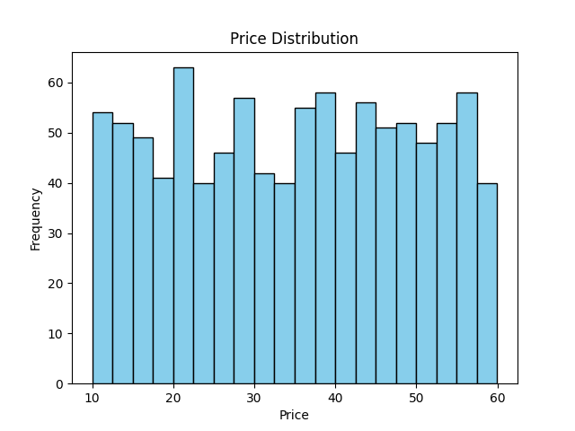
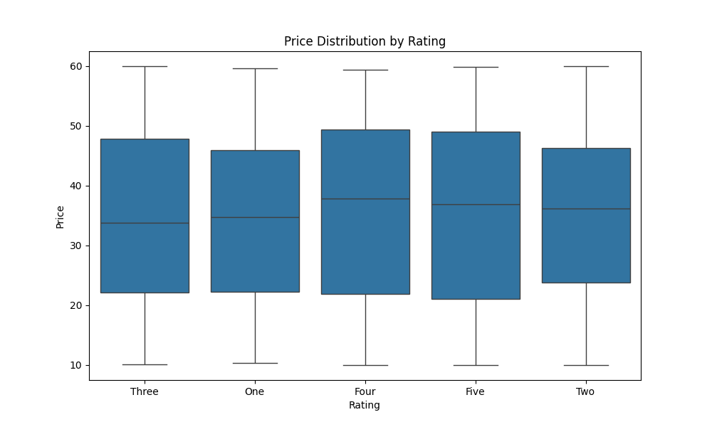

# Web Scraping and Data Analysis Project

## Overview
This project involves creating Python scripts to scrape book data from the "Books to Scrape" website, performs data analysis on the scraped data, and automates the execution of the scripts using Windows Task Scheduler. This project showcases skills in web scraping, data processing, analysis, and automation.

## Table of Contents

- [Prerequisites](#prerequisites)
- [Setup](#setup)
- [Analysis Images](#analysis-images)
- [Automation](#automation)

## Prerequisites
- Python 3.x  (3.12 used in development)
- Virtual environment (recommended)

## Setup

Follow these steps to set up the project:

1. **Clone the repository**

   Clone this repository to your local machine. You can do this by running the following command in your terminal:

   ```bash
   git clone https://github.com/Kevcar98/Web-scraping-and-Data-Analysis-Project.git

2. **Navigate to the project directory**

    Change your current directory to the project directory:

     ```bash
    cd Web-scraping-and-Data-Analysis-Project

3.  **Create a virtual environment**

    It's recommended to create a virtual environment to isolate the dependencies of this project from your other Python projects. You can create a virtual environment by running:
     ```bash
    python -m venv .venv

4.  **Activate the virtual environment**

    Activate the virtual environment by running:

    On Windows:

     ```bash
    .venv\Scripts\activate
     ```

    On Unix or MacOS:

     ```sh
    source .venv/bin/activate
     ```

5.  **Install the dependencies**

    Install the required Python packages by running:

     ```bash
    pip install -r requirements.txt

6.  **Run the scripts**

    Now you're ready to run the scripts. You can run the main script by executing:

     ```bash
    python scraper.py
    python analyze.py

## Analysis Images





## Automation

Comes with a .bat file to automate on Windows and .sh file so that you can use to automate on Unix or MacOS.

(Use Notepad or equivalent to edit the bat file and replace "C:\path\to\your\directory" to the directory where the python files are.)

(Do the same for the .sh file but instead replace /path/to/your/project to the directory your python files are.)
